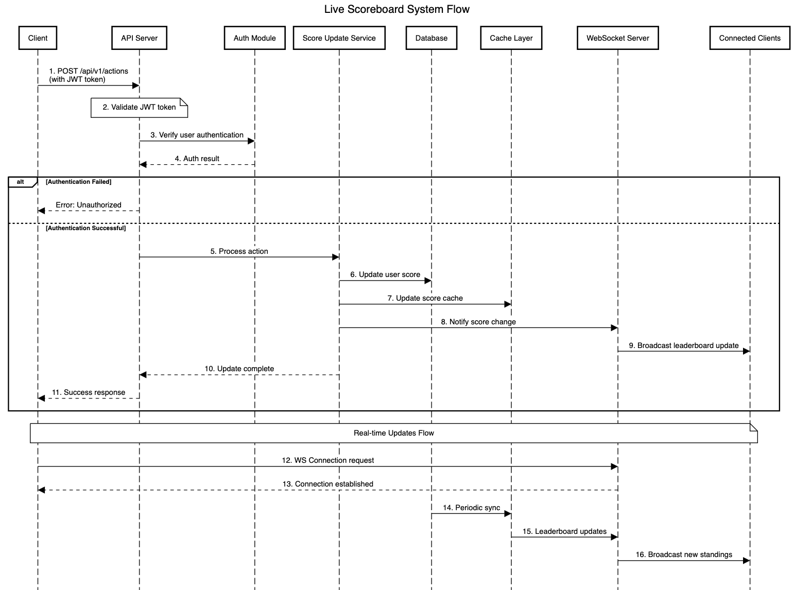

# Live Scoreboard Module Specification

## Overview

This module handles real-time score updates and maintains a live scoreboard showing the top 10 users. It ensures secure score updates and provides instant scoreboard synchronization across all connected clients.

## Core Features

- Real-time top 10 scoreboard updates
- WebSocket-based live updates
- Authentication and authorization for actions
- Rate limiting to prevent abuse

## System Architecture

### Components

1. **Score Update Service**

   - Handles score submission requests
   - Validates user authentication
   - Updates user scores in the database
   - Triggers WebSocket broadcasts

2. **Scoreboard Manager**

   - Maintains the top 10 leaderboard
   - Caches current standings
   - Handles real-time updates via WebSocket
   - Manages client connections

3. **Authentication Module**
   - Validates user tokens
   - Ensures secure score submissions
   - Prevents unauthorized access

### API Endpoints

#### 1. Send action

```
POST /api/v1/actions
Authorization: Bearer <token>
```

Request Body:

```json
{
  "actionId": "string"
}
```

Response:

```json
{
  "success": true,
  "newScore": number,
}
```

#### 2. Get Top Scoreboard

```
GET /api/v1/scores/leaderboard
```

Response:

```json
{
  "leaderboard": [
    {
      "userId": "string",
      "username": "string",
      "score": number,
    }
  ],
  "lastUpdated": "ISO8601"
}
```

#### 3. WebSocket Connection

```
WS /ws/scoreboard
```

Events:

- `leaderboard_update`: Emitted when scores change
- `connection_status`: Connection health checks

## Security Measures

### Score Submission Security

1. **Action Verification**

   - Each score update must include a valid actionId
   - Server validates action completion before updating score

2. **Rate Limiting**

   - Maximum of X actions per minute per user
   - Implements exponential backoff for repeated violations

3. **Authentication**
   - JWT-based authentication required for actions
   - Tokens must be valid and not expired

## System Flow Diagram



## Performance Considerations

### Caching Strategy

- Leaderboard cached in Redis
- Cache invalidation on score updates
- Periodic sync with database

## Development Guidelines

1. Use TypeScript for type safety
2. Follow REST API best practices
3. Implement comprehensive logging
4. Write unit and integration tests
5. Document all API changes

## Dependencies

- Node.js (v18+)
- Redis for caching
- PostgreSQL for persistent storage
- Socket.io for WebSocket handling
- JWT for authentication
